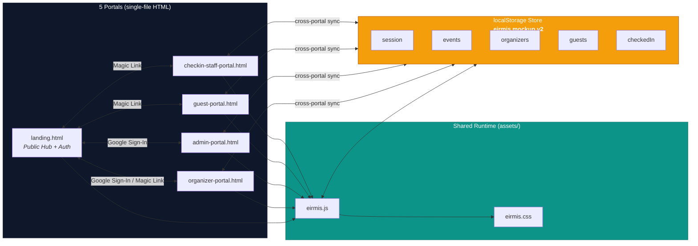
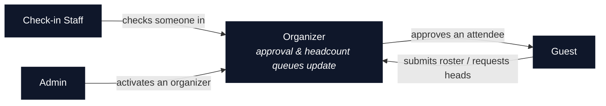
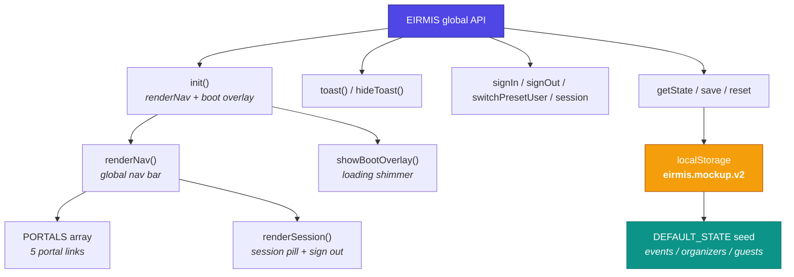
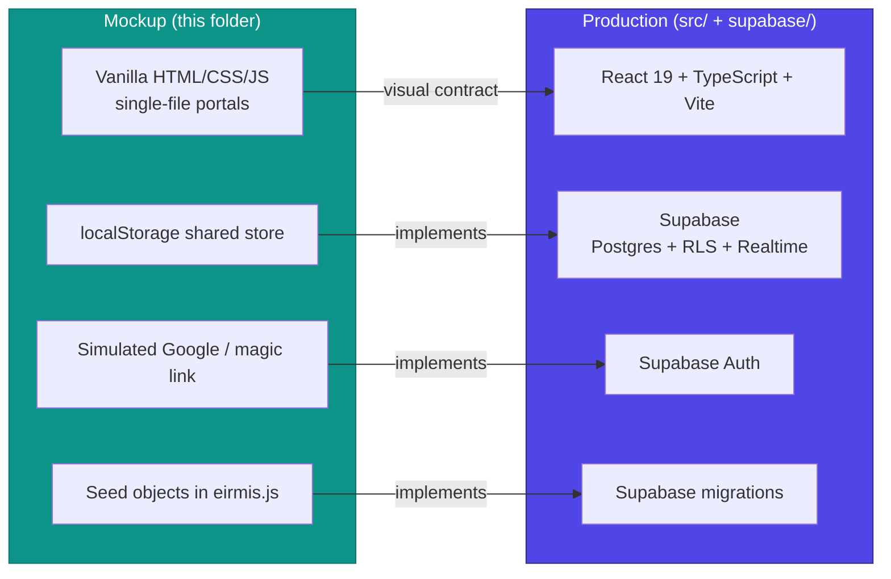

# EIRMIS Mockup — Architecture & Structure Diagrams

> **Status: CURRENT BASELINE (pre-review changes)**
> This documents the mockup structure as it currently stands, before any
> changes from the one-on-one meetings, evaluation, and review have been
> applied. It is a visualization for first-time users and reviewers.
> Future coders will update this file as they implement reviewer requests.

## Table of Contents

1. [Folder / File Structure](#1-folder--file-structure)
2. [System Architecture](#2-system-architecture)
3. [Four Roles & Their Functions](#3-four-roles--their-functions)
4. [Cross-Portal Handoffs](#4-cross-portal-handoffs)
5. [Shared Runtime Internals](#5-shared-runtime-internals)
6. [Mockup → Production Mapping](#6-mockup--production-mapping)
7. [Design System](#7-design-system)

---

## 1. Folder / File Structure

```mermaid
flowchart TD
    ROOT["MockupPlan/"] --> README["README.md<br/><i>overview & usage</i>"]
    ROOT --> DESIGN["design.md<br/><i>design tokens & system</i>"]
    ROOT --> ASSETS["assets/"]
    ROOT --> LANDING["landing/"]
    ROOT --> ORG["organizer-portal/"]
    ROOT --> ADMIN["admin-portal/"]
    ROOT --> GUEST["guest-portal/"]
    ROOT --> STAFF["checkin-staff-portal/"]

    ASSETS --> JS["eirmis.js<br/><i>shared runtime</i>"]
    ASSETS --> CSS["eirmis.css<br/><i>design system</i>"]
    ASSETS --> AREADME["README.md"]

    LANDING --> LHTML["landing.html"]
    LANDING --> LREADME["landing-README.md"]

    ORG --> OHTML["organizer-portal.html"]
    ORG --> OREADME["organizer-portal-README.md"]

    ADMIN --> ADHTML["admin-portal.html"]
    ADMIN --> ADREADME["admin-portal-README.md"]

    GUEST --> GHTML["guest-portal.html"]
    GUEST --> GREADME["guest-portal-README.md"]

    STAFF --> SHTML["checkin-staff-portal.html"]
    STAFF --> SREADME["checkin-staff-portal-README.md"]

    style ROOT fill:#4F46E5,color:#fff,stroke:#312E81
    style ASSETS fill:#0D9488,color:#fff,stroke:#0F766E
    style LANDING fill:#0F172A,color:#fff,stroke:#0F172A
    style ORG fill:#0F172A,color:#fff,stroke:#0F172A
    style ADMIN fill:#0F172A,color:#fff,stroke:#0F172A
    style GUEST fill:#0F172A,color:#fff,stroke:#0F172A
    style STAFF fill:#0F172A,color:#fff,stroke:#0F172A
```



---

## 2. System Architecture



---

## 3. Four Roles & Their Functions

```mermaid
flowchart TD
    L["landing.html<br/><b>Public Hub</b>"] -->|"Organizer card → Google Sign-In"| O
    L -->|"Admin card → Google Sign-In"| A
    L -->|"Guest card → Magic Link"| G
    L -->|"Staff card → Magic Link"| S

    subgraph O["Organizer Portal"]
        direction TB
        O1["Event CRUD + 4-step create wizard"]
        O2["Guest list & approval queue<br/><i>audited capacity override</i>"]
        O3["Reminders & invitation design validation"]
        O4["Live attendance + waitlist FIFO"]
        O5["Check-in config & staff assignments"]
        O6["Email / audit logs"]
    end

    subgraph A["Admin Portal"]
        direction TB
        A1["Organizer verification queue<br/><i>pending → active</i>"]
        A2["Org-wide settings"]
        A3["Zero-knowledge access boundary"]
    end

    subgraph G["Guest Portal"]
        direction TB
        G1["Mobile-first RSVP"]
        G2["Roster submission<br/><i>max_party_size ceiling</i>"]
        G3["Rejected-attendee resubmit"]
        G4["Headcount requests"]
        G5["Wallet-style QR pass"]
    end

    subgraph S["Check-in Staff Portal"]
        direction TB
        S1["Scoped scanning screen"]
        S2["Scan-result state machine"]
        S3["Manual search"]
        S4["Walk-in registration"]
    end

    style L fill:#4F46E5,color:#fff,stroke:#312E81
    style O fill:#0F172A,color:#fff,stroke:#0F172A
    style A fill:#0F172A,color:#fff,stroke:#0F172A
    style G fill:#0F172A,color:#fff,stroke:#0F172A
    style S fill:#0F172A,color:#fff,stroke:#0F172A
```



---

## 4. Cross-Portal Handoffs



---

## 5. Shared Runtime Internals



---

## 6. Mockup → Production Mapping



---

## 7. Design System

```mermaid
flowchart TD
    DS["Design System"] --> BRAND["Brand<br/><i>Modern SaaS Minimalism</i>"]
    DS --> COLORS["Colors"]
    DS --> TYPE["Typography"]
    DS --> LAYOUT["Layout & Spacing"]
    DS --> ELEV["Elevation & Depth"]
    DS --> SHAPES["Shapes"]

    COLORS --> C1["Primary: Indigo #4F46E5"]
    COLORS --> C2["Secondary: Teal #0D9488"]
    COLORS --> C3["Dark: #0F172A"]
    COLORS --> C4["Neutrals: Slate scale"]

    TYPE --> T1["Hanken Grotesk / Plus Jakarta Sans<br/><i>headings</i>"]
    TYPE --> T2["Inter<br/><i>body</i>"]

    LAYOUT --> L1["8px grid"]
    SHAPES --> S1["Radii: 8 / 12 / 16px"]

    style DS fill:#4F46E5,color:#fff,stroke:#312E81
    style COLORS fill:#0D9488,color:#fff,stroke:#0F766E